# TRST01 · EUDR plot mapping with a drone

**From one drone photo to EUDR-ready plot boundaries.** This toolkit is built for coffee estates in Chikmagalur. It places drone photos on the map, lines them up with satellite imagery, traces fields and whole land parcels, and exports them in the GeoJSON format EUDR requires (WGS84, 6 decimal places). It also plans the mapping flights and validates the farm files TRST01 sends.

<p align="center">
  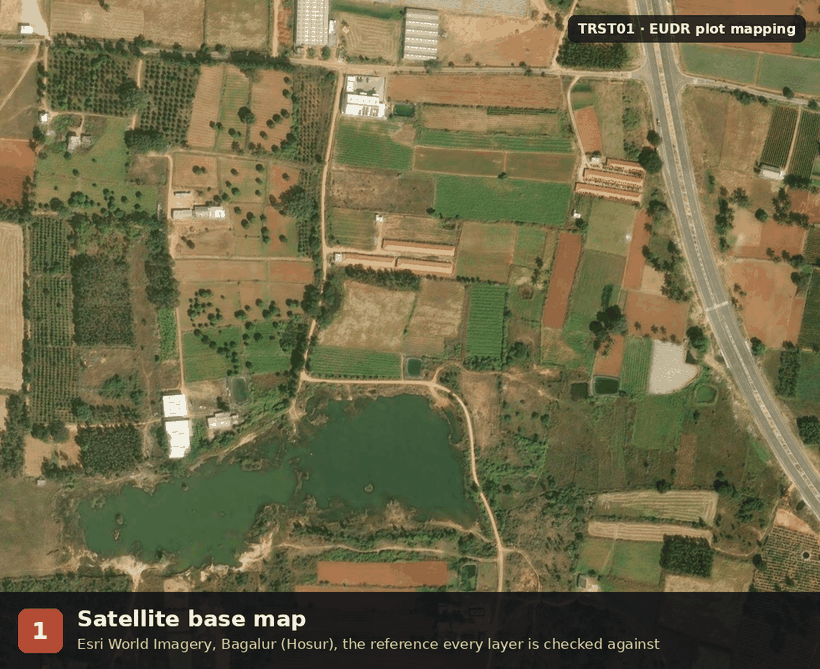
</p>

<p align="center"><sub>Test site: Bagalur (Hosur), one DJI Mini 3 Pro photo at 500 m. 14 whole plots (21.2 ha) and 45 fields, all passing <code>eudr_check</code>.</sub></p>

---

## Pipeline

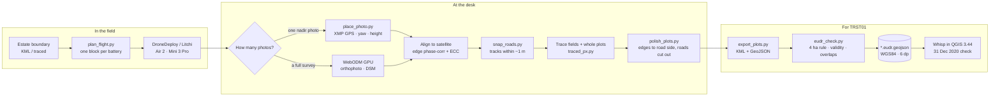
```mermaid
flowchart LR
    subgraph FIELD["In the field"]
        A[Estate boundary<br/>KML / traced] --> B[plan_flight.py<br/>one block per battery]
        B --> C[DroneDeploy / Litchi<br/>Air 2 · Mini 3 Pro]
    end
    subgraph DESK["At the desk"]
        C --> D{How many photos?}
        D -- "one nadir photo" --> E[place_photo.py<br/>XMP GPS · yaw · height]
        D -- "a full survey" --> F[WebODM GPU<br/>orthophoto · DSM]
        E --> G[Align to satellite<br/>edge phase-corr + ECC]
        F --> G
        G --> H[snap_roads.py<br/>tracks within ~1 m]
        H --> I[Trace fields + whole plots<br/>traced_px.py]
        I --> J[polish_plots.py<br/>edges to road side, roads cut out]
    end
    subgraph OUT["For TRST01"]
        J --> K[export_plots.py<br/>KML + GeoJSON]
        K --> L[eudr_check.py<br/>4 ha rule · validity · overlaps]
        L --> M[(*.eudr.geojson<br/>WGS84 · 6 dp)]
        M --> N[Whisp in QGIS 3.44<br/>31 Dec 2020 check]
    end
```

## The six steps

| | | |
|:-:|:-:|:-:|
| 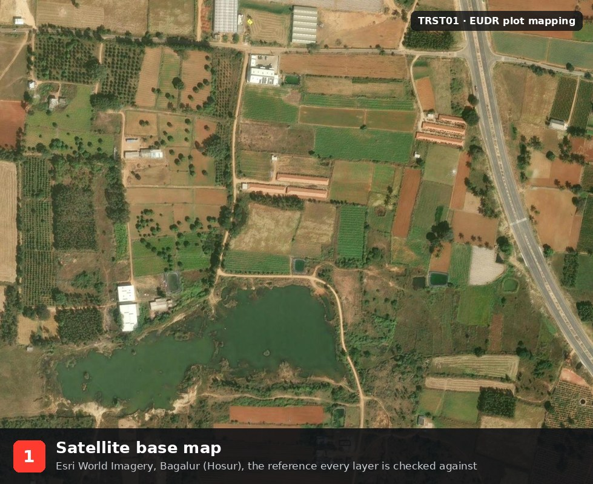<br/>**1 · Satellite base**<br/><sub>Esri World Imagery as the reference</sub> | 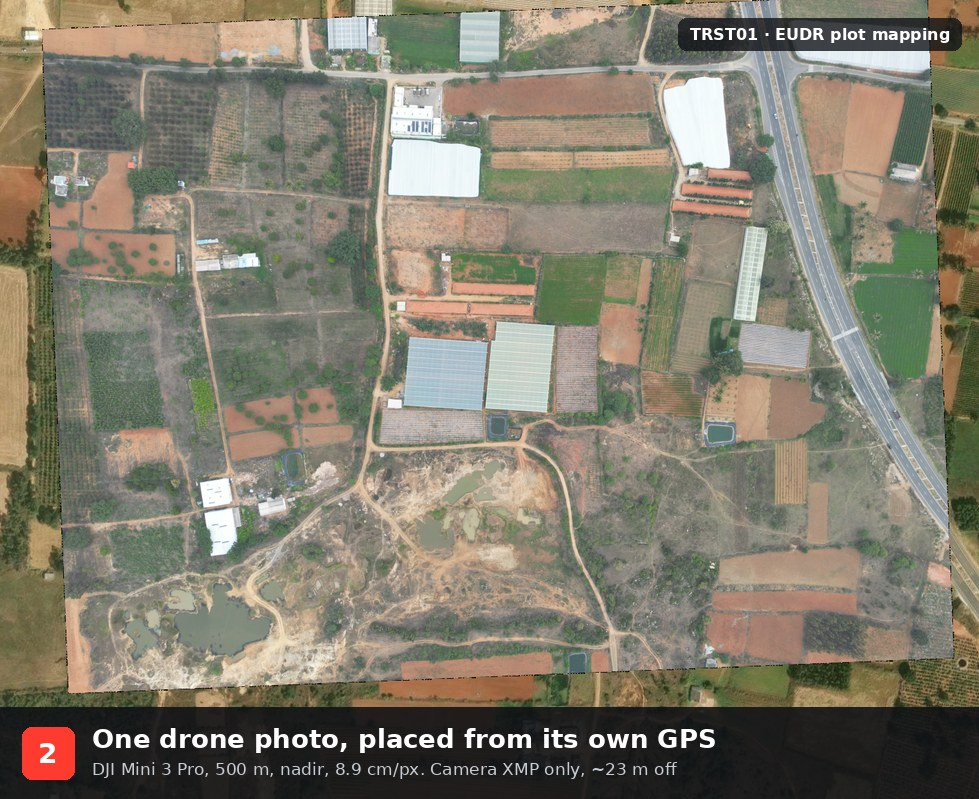<br/>**2 · GPS placement**<br/><sub>Camera XMP only: about 23 m off</sub> | 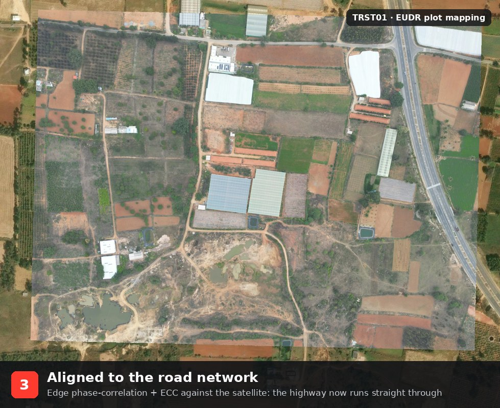<br/>**3 · Aligned**<br/><sub>Edge phase-correlation + ECC</sub> |
| 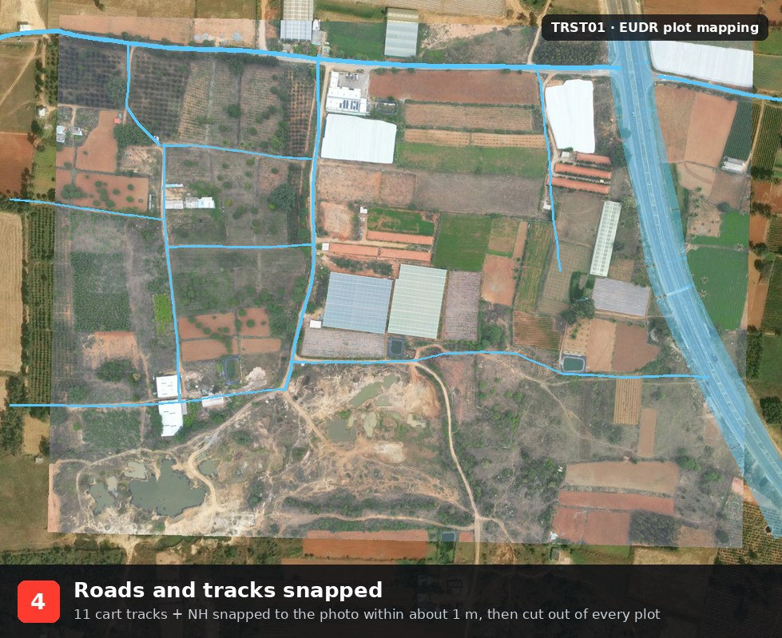<br/>**4 · Roads snapped**<br/><sub>11 tracks + highway, about 1 m</sub> | 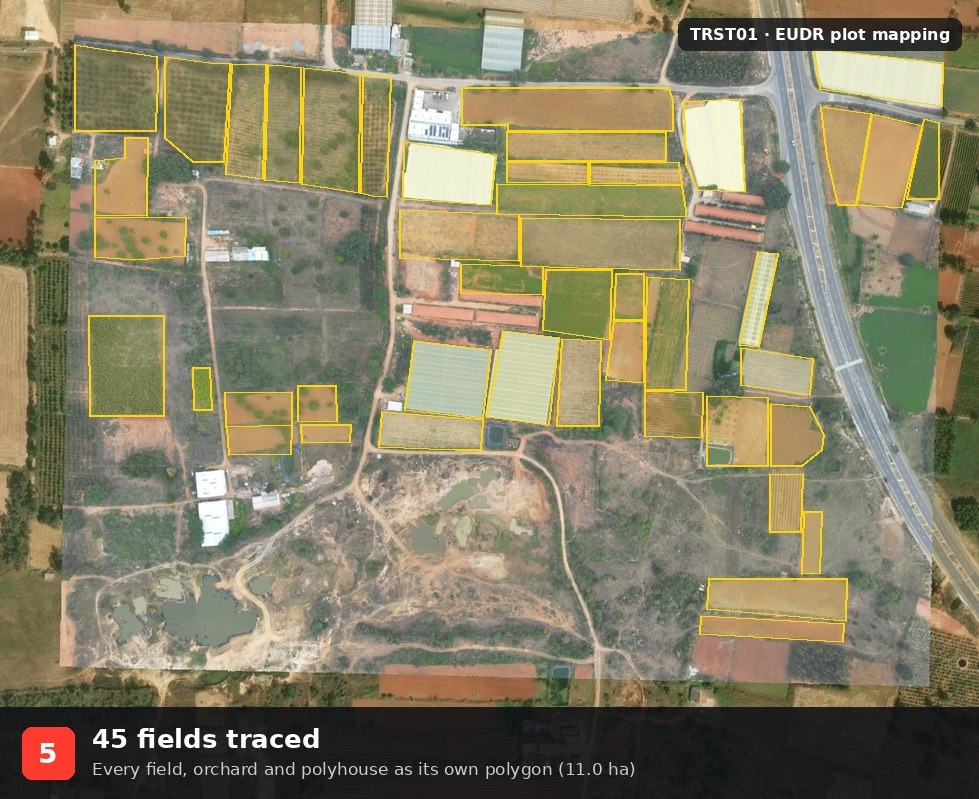<br/>**5 · 45 fields**<br/><sub>Every field, orchard and polyhouse</sub> | 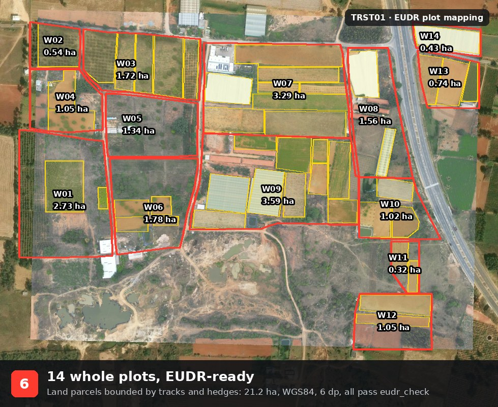<br/>**6 · 14 whole plots**<br/><sub>Bounded by tracks, hedges and the highway</sub> |

### GPS placement vs aligned

The drone's own GPS and compass put the photo about 23 m west and 19 m south of its true position, rotated 3.6°. Alignment against the satellite image fixes that. The highway is the easiest place to check.

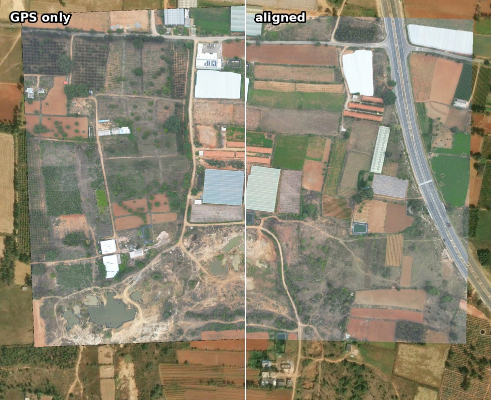

### Boundaries that stop at the road

Plot edges that run along a road are moved onto the side of the road, and the road itself is cut out, so no plot claims a strip of road. Neighbouring plots with no road between them share one line, so there are no slivers or double lines.

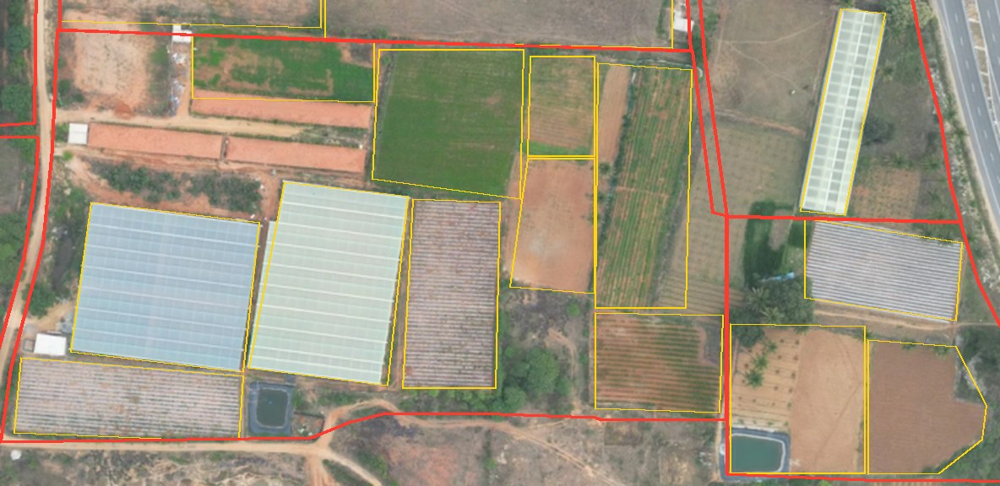

### Flight planning for the estates

`plan_flight.py` splits a boundary into one-battery blocks for DroneDeploy. The example is the Yelliemadaloo draft: 75.9 ha, Air 2 at 100 m, 3.6 cm/px, about 1,100 photos, 5 batteries.

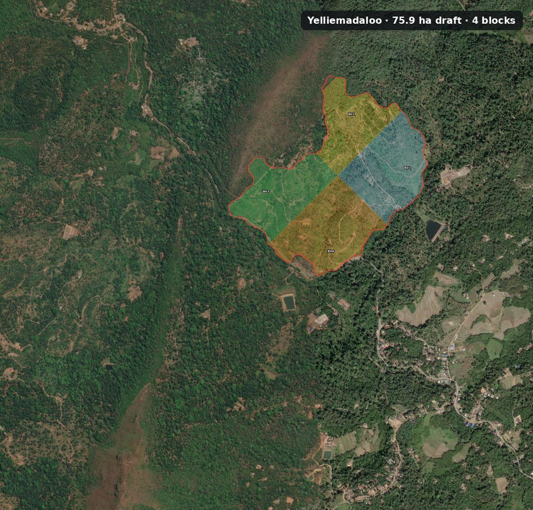

### WebODM, tested locally with the GPU

The ODM Aukerman sample (77 photos) processed in 14 minutes on an RTX 3070. Left: orthophoto. Right: elevation model (DSM).

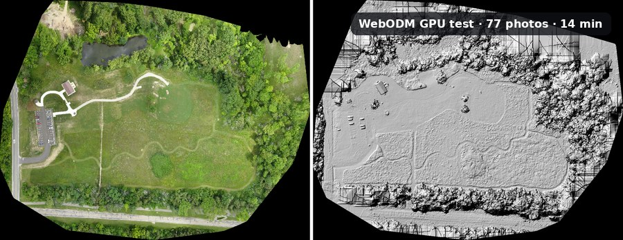

### WebODM on the Bagalur photos

This was not a mapping flight: the SD card has 3 straight-down photos (500 m, 300 m and 204 m) and 2 angled ones. Even so, WebODM builds a usable orthophoto from them. The best run is **v3**: all 5 photos, `feature-quality ultra`, `min-num-features 40000`, `pc-quality high`, `use-3dmesh`, `auto-boundary`, 4 cm/px, 6.5 min on the GPU. With only the 3 straight-down photos (v1 default, v2 `fast-orthophoto`), the map covers the low 204 m shot and not much more. The 3D mesh is poor in every run because there aren't enough overlapping views. A real flight at about 80% overlap fixes that.

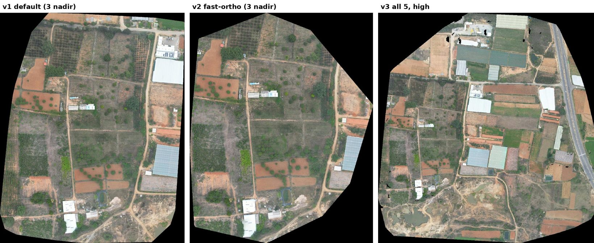

**Live, no login** (served from the desktop over Tailscale Funnel, so it works only while that PC is on):

- v3 map: https://b650-3070.tail641fa8.ts.net:8443/public/task/21b65540-af4f-4a21-81f4-af4234db12d4/map/
- v3 3D: https://b650-3070.tail641fa8.ts.net:8443/public/task/21b65540-af4f-4a21-81f4-af4234db12d4/3d/
- v2 fast-ortho map: https://b650-3070.tail641fa8.ts.net:8443/public/task/4a411725-b44f-435e-8fdf-c927f1980bd9/map/

The share links are view-only. The WebODM dashboard at the same host still needs the login.

### 3D from a single photo (AI depth) inside the satellite map, works on iPhone

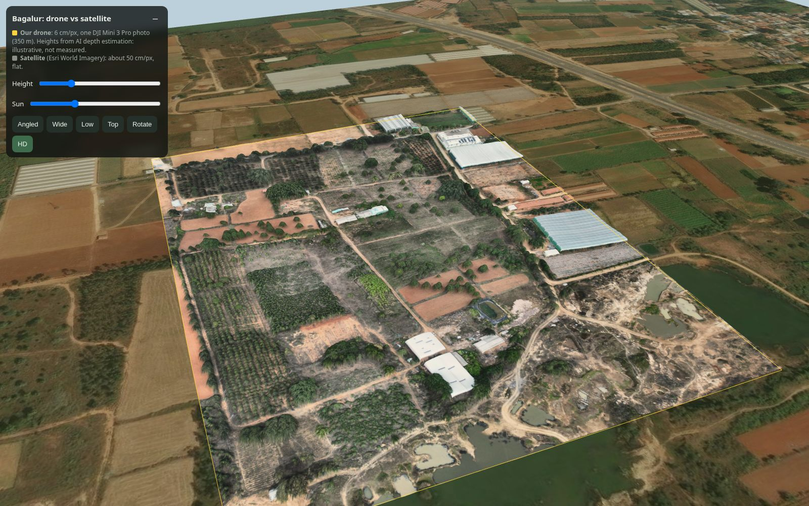

**Live:** https://pi-vps-mumbai-8gb.tail641fa8.ts.net/bagalur-3d/ (no login, hosted on the Mumbai VPS, always on; update with `rsync -az --delete test-data/bagalur/ai3d/web/ root@100.77.25.115:/srv/bagalur-3d/`)

Depth Anything V2 (Large, run locally on the RTX 3070) estimates a height for every pixel of DJI_0995 (350 m, straight down). The large-scale tilt the model adds is removed. The result is draped with the photo in a three.js viewer: orbit, zoom, change the height and the sun.

The photo sits at its true position inside a 2 × 1.5 km block of Esri satellite imagery, outlined in yellow, so the extra detail from the drone (6 cm/px vs about 50 cm/px) is obvious. Placement: DJI_0995 is SIFT-matched to DJI_0001 (already aligned to the satellite), with 1,060 inlier points and a median error of 0.8 m (`align_to_0001.py`). On top of that, `seam_refine.py` measures the local drone-vs-satellite offset in 75 tiles of 80 m (2.4 m typical, up to 7.4 m, from lens distortion and the camera tilt) and fits a smoothed spline. The viewer applies that spline as a correction grid, so roads run straight across the border: about 0.8 m typical error on held-out tiles. The border is a 1 px line. **Wide** shows the whole block.

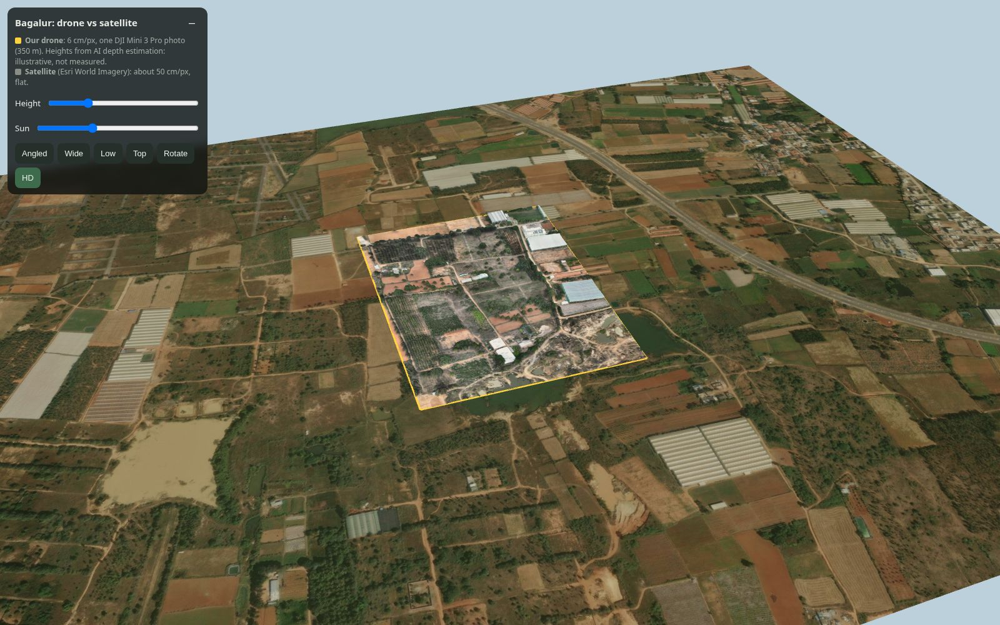

**Trees and buildings are real 3D objects, found by open-source models** (all run locally, no paid API):

- **Trees:** DeepForest (tree-crown detector trained on 10 cm aerial imagery, the same scale as this photo) finds the separate trees; dense blocks and clumps get one crown per bright canopy peak. 854 trees in total (`trees.py`, `relief2.py`). The viewer builds each on a trunk with a crown coloured by the photo projected straight down: big trees are a cluster of lobes, small ones a single lobe, undersides shaded. Coconut palms are picked out by their radial fronds (image edges run around the crown instead of across it) and get a tall trunk with drooping fronds.
- **Buildings:** SAM 2.1 segments the photo; segments that are raised in the AI depth, not vegetation and compact are kept as roofs, plus a few clicked by hand where it missed (`sam_masks.py`, `sam_points.py`, `buildings.py`). 39 footprints, extruded with the photo on the roof and plain vertical walls. The 17 plain rectangles of house or shed size get a ridge (gable) roof; greenhouses stay flat.
- The ground keeps only a gentle relief from Depth Anything V2.

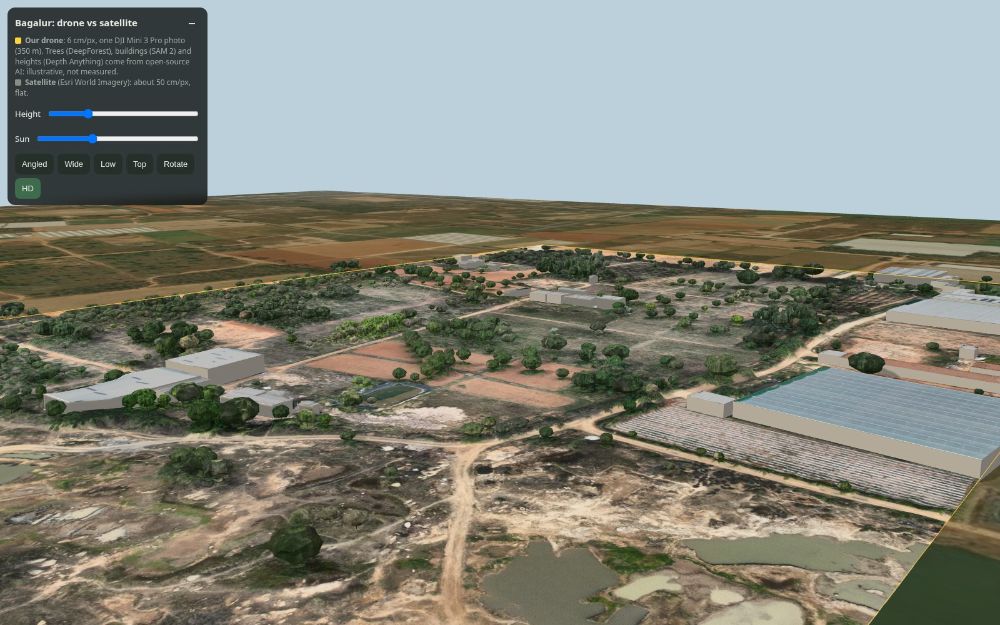

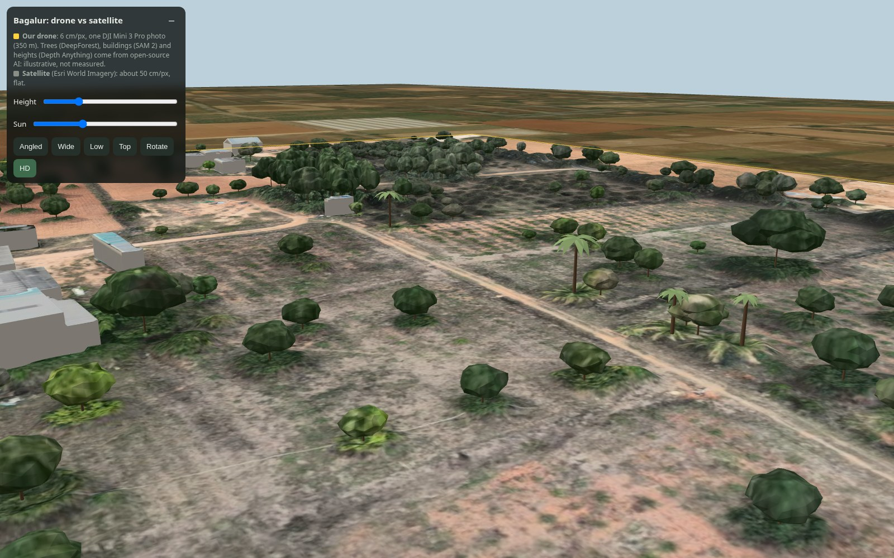

Close-up links: add `?cam=x,y,z,tx,ty,tz` (camera and target, metres from the centre of the photo).

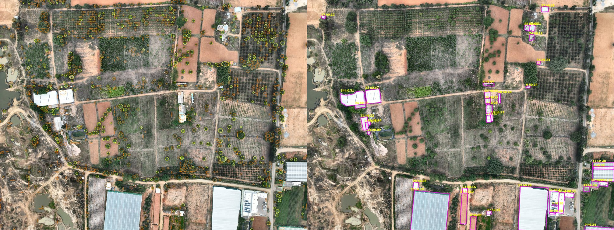

- **Phones:** the viewer loads a light version by default (2048 px photo, 504×378 grid, about 2.5 MB). It frames portrait screens to fit, redraws only when something moves, and has an **HD** button for the full 4032 px version.
- **Heights are illustrative, not measured.** Use WebODM or a survey for anything that needs real heights.

| AI depth viewer (real photo, estimated heights) | AI render (Higgsfield Nano Banana Pro) | iPhone 12 |
|:-:|:-:|:-:|
| 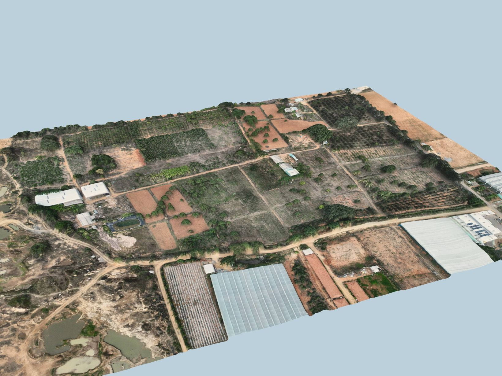 | 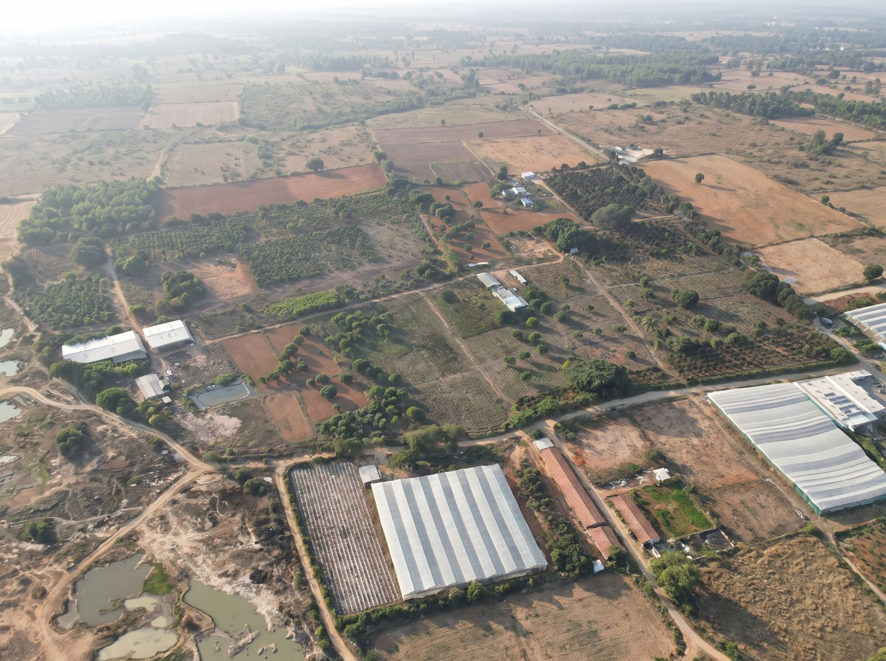 | 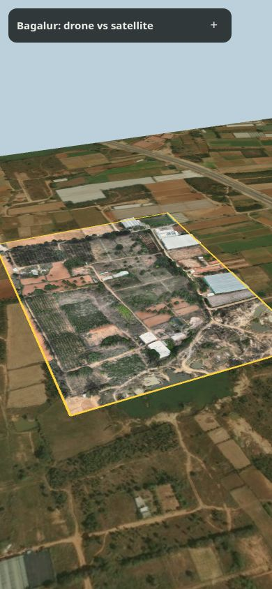 |

The middle image is **AI-generated**. It was made from the depth-viewer render (angle and layout) plus the real photo (detail), 2 credits. The layout matches the farm, but the trees, walls and background are invented, so it is for pitch visuals only and never for EUDR. The code is in `test-data/bagalur/ai3d/` (`depth.py`, `relief2.py`, `trees.py`, `buildings.py`, `prompt.txt`, `web/`).

### Cesium ion globe: marketing view with annotations (branch `cesium-ion`)

**Live:** https://pi-vps-bombay-16gb.tail641fa8.ts.net/bagalur-map/ (no login, hosted on the Bombay VPS)

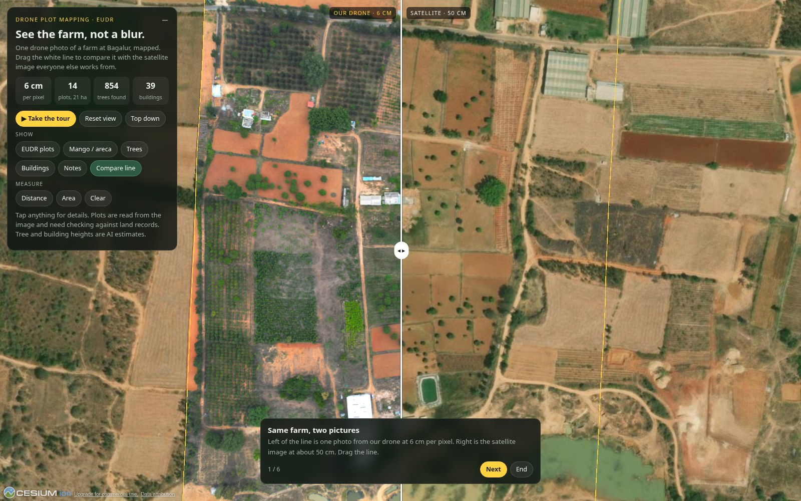

The full-resolution photo (6 cm/px) is uploaded to Cesium ion as a tiled imagery layer and shown on the 3D globe over world terrain, with one button to switch between the drone photo and Bing satellite imagery. On top of it:

- the 14 whole plots with area, tap for the EUDR details
- mango and areca nut (supari) blocks with approximate plant counts (one greenness peak per plant)
- 1,323 trees and plants and 39 buildings in 3D, a few notes (polyhouses, sheds, ponds, solar roof). Trees are instanced game-style models (trunk, branches, alpha leaf cards; mango-type, coconut and areca), about 1 MB for all of them (`build_trees.py`). Each tree takes the colour of its own crown in the drone photo (9 leaf tints), with light baked in: sunlit top, shaded underside. Every counted orchard plant gets one. Buildings carry the real roof photo, with gable roofs (`build_model.py`). Both sit on Cesium's terrain: the ground rises about 13 m across the farm, so heights are sampled once (`terrain_grid.json`) and baked in
- the photo is dehazed and sharpened before tiling (`enhance.py`: veil subtraction, local contrast, clipped unsharp mask; classical filters only, no AI super-resolution, so every pixel is still evidence). The page draws at the screen's real pixel density and loads finer tiles sooner
- double-click (or double-tap) a spot to fly in and circle it until the next touch
- distance and area measuring, and a 6-step guided tour (`?tour=1` to `?tour=6` link straight to a step)

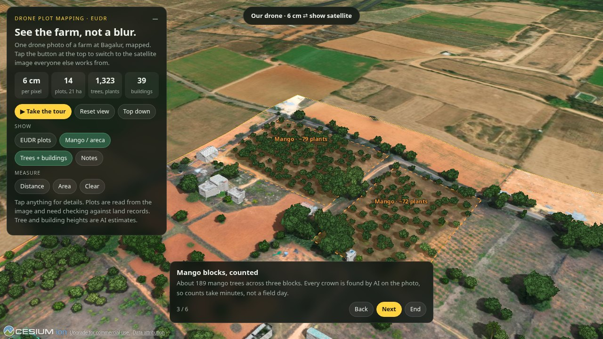

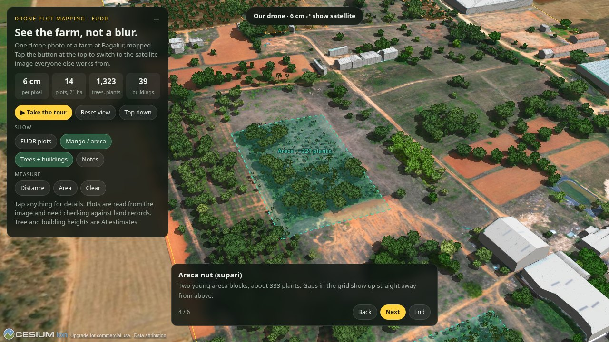

Code is in `test-data/bagalur/cesium/`: `geo.py` (photo pixel to lon/lat with the viewer's alignment), `make_geotiff.py`, `ion_upload.py`, `build_data.py`, `web/`. The page uses a read-only ion token that only works from the Bombay host (other sites get 403; ion does not enforce a per-asset limit on it, so it can read any asset in the account, never write). The admin token stays in `~/.config/cesium/ion-token` and is never published. **Cesium ion's free plan is for non-commercial use**: move to a paid plan before using this page to sell.

---

## Tools

| Script | What it does |
|---|---|
| `eudr_check.py` | Validates any GDAL-readable farm file (KML/KMZ, GeoJSON, SHP, GPKG, GPX, CSV). Enforces the >4 ha polygon rule, valid rings, ≥4 vertices and an India bounding box (catches swapped lat/lon). Flags declared vs mapped area more than 25% apart, overlaps and multi-part plots. Writes `*.eudr.geojson` (EPSG:4326, 6 dp) and `*.report.csv`. |
| `plan_flight.py` | Splits a boundary into one-battery blocks (`*.blocks.kml`), flight lines and a plan (GSD, overlap, batteries, photo count, WebODM job size). Drones: `air2`, `air2s`, `mini3pro`. Refuses heights above 120 m. |
| `place_photo.py` | Places one straight-down DJI photo from its XMP data (GPS, relative altitude, gimbal yaw) as a GeoTIFF at the photo's own GSD. `--raw` develops the DNG instead. |
| `develop_dng.py` | Develops a DJI DNG with rawpy using the camera's white balance (runs in `.venv`). |
| `match_colors.py`, `dehaze.py` | Colour experiments, kept for reference. The camera JPG looked the most natural. |
| `test-data/bagalur/plots/snap_roads.py` | Snaps rough road centre lines onto the tracks in the photo (white top-hat ridge search, smoothed). |
| `test-data/bagalur/plots/polish_plots.py` | Moves plot edges onto the road side, re-intersects corners, cuts roads out and clips fields to their whole plot. `FIXED` plots are only road-cut, never moved. |
| `test-data/bagalur/plots/export_plots.py` | Converts pixel outlines to WGS84 KML: `bagalur_plots.kml` (fields) and `bagalur_whole_plot.kml`. |
| `docs/make_media.py` | Rebuilds every image in this README from the project data. |

## Quick start

```bash
# validate whatever TRST01 sends
./eudr_check.py incoming/            # -> out/<file>.eudr.geojson + .report.csv
./eudr_check.py incoming/ --fix      # also repairs self-intersections; always check the shape

# plan an estate before the visit
./plan_flight.py estates/3_yelliemadaloo_murgadi/boundary.kml --drone air2 --alt 100

# one photo -> plots
./place_photo.py /media/.../DJI_0001.JPG -o test-data/bagalur/jpg
cd test-data/bagalur/plots
./snap_roads.py && ./polish_plots.py && ./export_plots.py
../../../eudr_check.py bagalur_whole_plot.kml bagalur_plots.kml -o .
```

Then open `*.eudr.geojson` in QGIS 3.44 LTR and run the **Whisp** plugin for the 31 Dec 2020 deforestation check. Whisp supports QGIS up to 3.99 only, so it won't run in the QGIS 4.x Flatpak.

## EUDR rules applied

- Plots **over 4 ha need a polygon**; 4 ha or less can be a point.
- WGS84 (EPSG:4326), at least 6 decimal places, GeoJSON.
- Deforestation cutoff: **31 Dec 2020**. Applies from **30 Dec 2026** to large operators and **30 Jun 2027** to small ones.

## Repo layout

```
eudr_check.py  plan_flight.py  place_photo.py  develop_dng.py  match_colors.py  dehaze.py
estates/                 estate pins + per-estate boundary, blocks, lines, plan (Yelliemadaloo draft)
samples/                 MADE-UP test farms and a synthetic 413 ha estate
test-data/bagalur/plots/ the traced Bagalur plots, roads and the plot pipeline scripts
docs/                    README media + make_media.py
```

**Not in git:** drone photos, GeoTIFFs, WebODM outputs, the Python venv, and `aggregator/`. That folder holds the estate contacts, which include people's personal phone numbers, so it stays on this machine only. Run `python3 -m venv .venv && .venv/bin/pip install rawpy numpy pillow opencv-python-headless scikit-image` to rebuild the venv.

## Caveats

- Whole plots are **read from the image**: tracks, hedges and changes in land use. They are not legal boundaries. Before anything goes to TRST01, the aggregator or farmer must confirm each plot against the land records (RTC / survey number).
- Edges along roads are snapped to within about 1 m. Hand-traced edges along hedges and between fields are accurate to about 1–2 m. The whole photo can be off by a few metres, because it is aligned to satellite imagery.
- Esri World Imagery is used for alignment, review and the satellite surround in the public 3D viewer. Check its licence before any client-facing redistribution.
- `samples/TEST_*` files are synthetic, not real farms.
